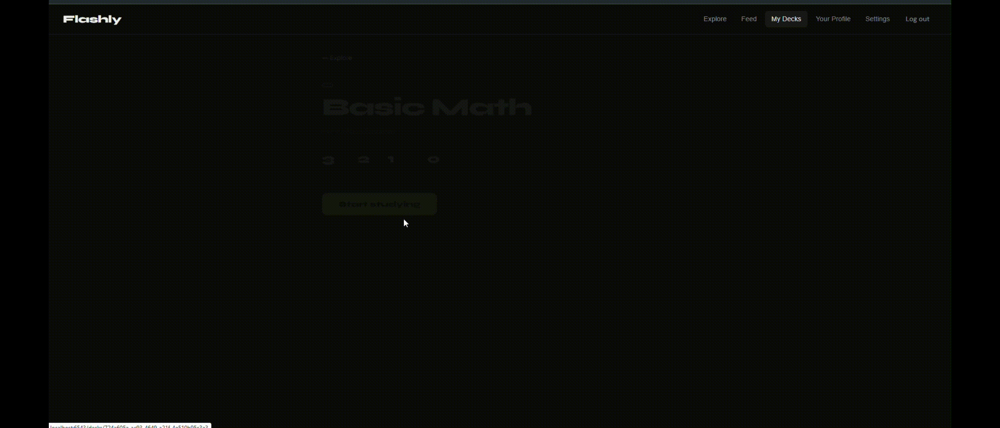

# Flashly

## About this project

Flashly is a web application for creating and managing flashcards to help you study. It is built using Python,
utilizing the Pyramid framework. The goal of this project was to experiment building an application using Python
and building a social media like project.

### Demo

## Getting Started

1) Install Python 3.7 or newer.

2) Setup Postgres database to connect to.

2) Create a virtual environment: `python3 -m venv venv`

3) Activate the virtual environment: `source venv/bin/activate` (on Linux/macOS)

4) Install the project dependencies: `poetry install`

5) Copy example environment file and enter values: `cp .env.example .env`

6) Initialize the database tables: `make migrate`

5) Run the application in development mode: `make dev`

6) The application should now be running.

## Deployment

Not currently deployed.

## Contact

Nicholas Chumney - [nicholas.chumney@outlook.com](nicholas.chumney@outlook.com)
